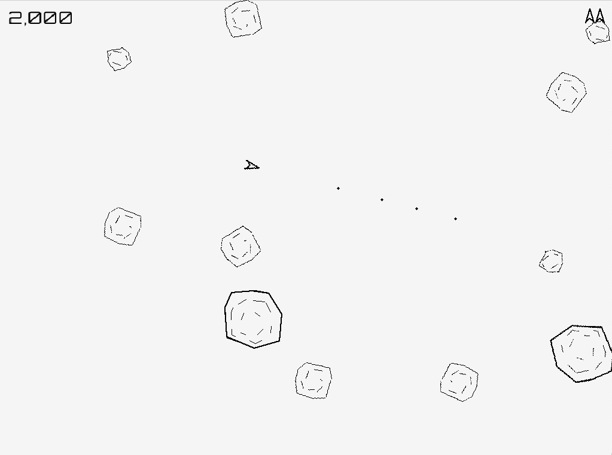

# avoid-space-rocks-go

Asteroids clone written in Go.



It's available for [download on itch.io](https://kickboxfrownyface.itch.io/avoid-the-space-rocks) for free.

## Build Requirements

Follow the instructions in https://github.com/gen2brain/raylib-go/blob/master/README.md to install the 
raylib-go library locally. Then:

```bash
go build cmd/avoid-space-rocks-go/main.go
```
